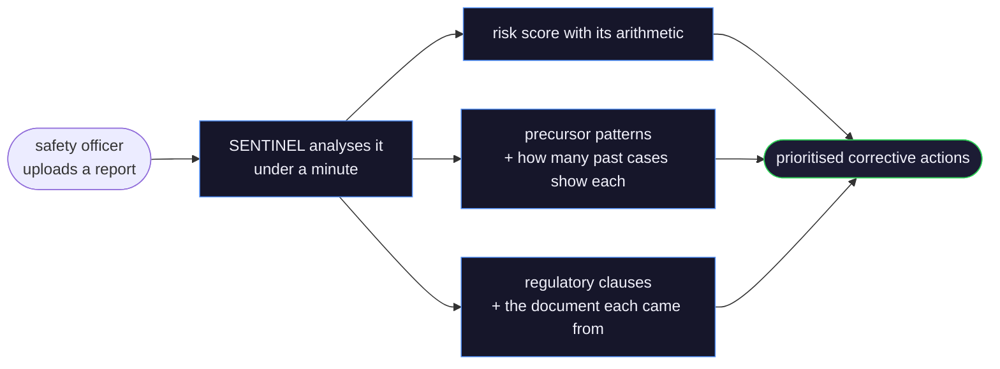
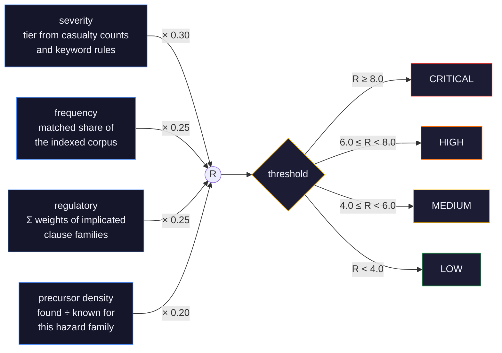

# SENTINEL

**Safety ENTRy INcident Threat Early-warning Layer**

Upload a workplace safety incident report. SENTINEL extracts the structured
incident, finds the precursor conditions it shares with historical cases,
retrieves the regulatory clauses that apply, computes an explainable risk
score, and streams every stage to the browser as it happens.

It is not a summariser. The question it answers is *what warning signs does
this report contain that preceded other accidents* — precursor detection, not
classification.

---

## Table of contents

- [Why this exists](#why-this-exists)
- [What makes it more than RAG](#what-makes-it-more-than-rag)
- [Why there is no vector database by default](#why-there-is-no-vector-database-by-default)
- [Repository layout](#repository-layout)
- [Quick start](#quick-start)
- [Building the corpus](#building-the-corpus)
- [Configuration](#configuration)
- [The risk score](#the-risk-score)
- [Security](#security)
- [Development](#development)
- [Deployment](#deployment)
- [Deliberate simplifications](#deliberate-simplifications)
- [Further reading](#further-reading)

---

## Why this exists

India recorded over 48,000 factory accidents in 2022 (DGFASLI Annual Report).
Most are investigated in isolation: a report is written, a corrective action is
logged, and the pattern connecting it to the last twelve incidents is never
surfaced. Safety officers, EHS managers and factory inspectors have the reports
but not the cross-report view.

SENTINEL's workflow is the one those users already have — open a report, read
it, act on it — with the corpus comparison added:



Every finding is traceable to the passage it came from.

## What makes it more than RAG

| | Typical RAG demo | SENTINEL |
|---|---|---|
| Retrieval | one dense index | BM25 + dense in parallel, merged with reciprocal rank fusion, cross-encoder reranked, then contextually compressed |
| Vector store | a managed DB regardless of corpus size | an exact numpy search by default, Qdrant behind one env var when the corpus outgrows it |
| Embeddings | `sentence-transformers`, and therefore PyTorch | the same bge-small model on ONNX Runtime — 150MB installed, not 2.5GB |
| Chunking | fixed character windows | semantic splits at topic boundaries, within section headings |
| Orchestration | a sequential chain | a typed LangGraph state machine with a conditional escalation path and an error node |
| Scoring | the model is asked for a number | a deterministic four-component Python formula; every component is reported with its weight |
| Citations | the model writes them | every clause is a retrieved passage — an uncited regulation cannot be produced |
| Progress | a spinner | server-sent events per agent node, replayable if the client connects late |

## Repository layout

```
.
├── backend/              FastAPI + LangGraph service (this is complete)
│   ├── app/
│   │   ├── agents/       LangGraph state, nodes, graph
│   │   ├── api/          HTTP routes only, no business logic
│   │   ├── cache/        Upstash REST client with an in-process fallback
│   │   ├── db/           SQLAlchemy models, session, queries
│   │   ├── ingest/       PDF loading, cleaning, document classification
│   │   ├── knowledge_graph/  NetworkX causal graph over the corpus
│   │   ├── models/       Pydantic models — the source of truth for every shape
│   │   ├── rag/          chunker, embedder, vector store, BM25, retriever
│   │   └── tools/        the ten tools
│   ├── data/             corpus, taxonomies, generated indexes
│   ├── scripts/          one-off corpus ingestion
│   └── tests/            149 tests, no network access required
├── docs/
│   ├── ARCHITECTURE.md   how a request flows through the system
│   ├── API.md            the HTTP contract
│   ├── CODE_AUDIT.md     generated: cycles, layering, coupling
│   └── codegraph-vault/  generated: Obsidian vault of the module graph
├── scripts/
│   └── codegraph_vault.py    regenerates the two above from the CodeGraph index
└── PRD.md                the original product requirements
```

> **Frontend status:** in progress in `frontend/`, built against the contract in
> [`docs/API.md`](docs/API.md). The backend is complete and does not depend on it.

## Quick start

Requires Python 3.11 or 3.12. (Some pinned dependencies have no 3.13+ wheels.)

```bash
cd backend
python -m venv .venv
source .venv/bin/activate          # Windows: .venv\Scripts\activate
pip install -r requirements-dev.txt

cp .env.example .env               # then fill in at least GEMINI_API_KEY
uvicorn app.main:app --reload
```

Open <http://localhost:8000/docs>. `GET /health` reports which integrations are
configured.

**The app starts with nothing configured.** Each missing credential disables
one capability rather than blocking startup:

| Missing | Effect |
|---|---|
| `GEMINI_API_KEY` and `GROQ_API_KEY` | no LLM extraction; rules-only output at low confidence |
| `DATABASE_URL` | falls back to a local SQLite file |
| `UPSTASH_REDIS_REST_URL` | cache and rate-limit counters are per-process |
| `QDRANT_URL` | **nothing** — the local vector index is the default, see below |

This is what makes the test suite run offline, and it means a partially
configured deploy degrades visibly instead of crashing.

## Dependency choices worth knowing about

Each of these was measured rather than assumed.

| Choice | Instead of | Why |
|---|---|---|
| `fastembed` (ONNX) | `sentence-transformers` (PyTorch) | identical bge-small-en-v1.5 vectors, ~150MB installed against ~2.5GB. PyTorch and the CUDA packages do not appear in the base install at all. |
| spaCy `blank` + entity ruler | `en_core_web_sm` | measured on real incident text, the statistical NER added only `"march 14, 2023"` and `"zero"` — nothing this domain uses. Every hazard, chemical, equipment, condition and unsafe act came from the dictionary ruler. Dropping it removes a model, a build step and most of the load time. |
| LLM asked for *missed* entities | LLM asked to verify found ones | the ruler is a closed vocabulary, so recall is the real gap. Same single call, strictly more value. |
| `numpy` brute-force vectors | Qdrant Cloud | see below |
| `qdrant-client` in its own extra | the base install | it pulls grpcio, a slow build, and is only reachable when `QDRANT_URL` is set |
| LangGraph `recursion_limit` | a hand-rolled step counter | the hand-rolled one capped below the real path length and truncated every run |
| `click==8.1.8` pinned | latest Click | spaCy 3.7.5 imports `click.parser.split_arg_string`, deprecated in 8.2; unpinned, `import spacy` emits a DeprecationWarning |

## Why there is no vector database by default

The PRD specified Qdrant Cloud. For this corpus that is a dependency bought for
nothing: 80 documents chunk to roughly 2,000 vectors, which at 384 dimensions is
about 3MB. An exhaustive cosine search over that is a single `numpy` matmul —
faster than the network round trip it replaces, exact rather than approximate,
with no credential to leak, no cluster to cold-start and no reason to be online.

So `app/rag/vector_store.py` dispatches to one of two real backends:

| | default | `QDRANT_URL` set |
|---|---|---|
| implementation | `local_store.py`, an `.npz` of float32 vectors plus a JSON sidecar | `qdrant_store.py` |
| search | exact, in-process | approximate, over the network |
| sensible up to | ~100k chunks (~150MB, tens of ms) | far beyond that |
| setup | run the ingest script | cluster, API key, network |

Nothing is pickled in the local format, so loading an index cannot execute code.
The switch is one environment variable, and `GET /health` reports which backend
is live. Both paths are exercised by the same code; this is not an interface
with one implementation.

## Building the corpus

Retrieval needs a corpus. Both scripts are one-off and idempotent — chunk ids
are derived from content, so re-running replaces rather than duplicates.

```bash
python scripts/fetch_corpus.py       # download it: CSB reports + OSHA standards
python scripts/ingest_corpus.py      # chunk, embed, index, build the graph
python scripts/seed_regulatory.py    # same for the regulatory collection
```

`fetch_corpus.py` pulls from the authoritative hosts: OSHA standards from the
[eCFR API](https://www.ecfr.gov) as verbatim text, and completed investigation
reports from the [CSB](https://www.csb.gov) as published PDFs. Both are public
domain. It skips files already on disk, so an interrupted run resumes, and it
deduplicates reports CSB publishes under more than one slug.

`ingest_corpus.py` chunks each document semantically, embeds it, writes the
vector index, builds the BM25 sidecar index, builds the NetworkX causal graph,
and writes `corpus_manifest.json` — which is what the frequency component of the
risk score divides by, so the number stays honest about how much corpus exists.

The indexes are read through `lru_cache`, so a running server keeps serving the
index it loaded at first query. Ingestion is a pre-deploy step — run it before
starting the app, or restart the app after re-running it.

**Those generated files are committed.** With the local backend they *are* the
deployable corpus, so `backend/data/vectors_*.npz`, `bm25_*.pkl`,
`knowledge_graph.json` and `corpus_manifest.json` belong in the repository. The
source PDFs do not — they are large, and the indexes already carry the text.

Both directories' READMEs list the free public sources (OSHA IMIS, CSB, NIOSH
FACE, HSE, eCFR) and the file-naming convention. **File names matter**: an
incident's file name becomes its title in the UI, and a regulation's file name
becomes its citation.

## Configuration

Every setting is read once into `app/config.py` through `pydantic-settings`.
Nothing in the codebase reads `os.environ` directly. `.env.example` documents
the full set; the ones worth knowing about:

| Variable | Default | Notes |
|---|---|---|
| `DATABASE_URL` | `sqlite+aiosqlite:///./sentinel.db` | use `postgresql+asyncpg://…` for Supabase |
| `SPACY_MODEL` | `blank` | tokeniser + entity ruler, no model download; set `en_core_web_sm` to add statistical NER |
| `QDRANT_URL` | empty | set it *and* install `requirements-qdrant.txt` to switch backends |
| `MAX_ANALYSES_PER_IP_PER_HOUR` | `10` | applies to `POST /analyze` only |
| `TRUST_PROXY_HEADERS` | `false` | set to `true` only behind a proxy you control |
| `ANALYSIS_CACHE_TTL_SECONDS` | `3600` | how long an identical upload returns the cached result |
| `CORS_ORIGINS` | `http://localhost:3000` | comma-separated |

## The risk score

Pure Python, deterministic, no model involvement — `app/tools/scoring.py`.



Each component is scored 0–10, rounded, then weighted.

Each component is returned with its score, its weight and a sentence saying
where the number came from, so the total can be recomputed by hand from the UI.
The clause weights live in `CLAUSE_WEIGHT_MAP`; the precursor denominators come
from `data/precursors.json`.

Two things the component definitions get right, because getting them wrong was
caught by running the pipeline against a real index rather than a test double:

- **Confidence comes from rank, not from the reranker's raw score.** FlashRank
  orders well but its magnitudes are not calibrated — it scores a verbatim
  matching lockout/tagout clause at 0.00003. Using that as a confidence made the
  regulatory component permanently zero. Rank is the part of its output that
  carries meaning.
- **Frequency counts documents on both sides of the ratio.** Retrieval returns
  chunks, so one report split into eight pieces used to read as eight similar
  incidents. Matches are deduplicated by source document, and `FREQUENCY_SCALE`
  is tuned so the component spans a useful range instead of pinning at the first
  match.

Precursor patterns are reported whether or not the corpus corroborates them,
carrying `evidence_count` so the reader can tell "seen in 9 historical
incidents" from "not corroborated". Only about eight compressed excerpts are
retrieved, so any corroboration threshold silently discards real findings.

## Security

The API is anonymous and accepts file uploads, so every control below exists to
bound what one unauthenticated caller can cause. Each has a test in
`tests/test_security.py`; removing a control breaks a test.

| Control | Detail |
|---|---|
| Upload size | read in 64KB chunks and refused the moment it passes `MAX_UPLOAD_BYTES`, rather than after buffering the whole body |
| File type | must end `.pdf` **and** begin with the `%PDF` magic number — the declared MIME type is not trusted |
| Filename | directory components and non-printable characters stripped, length capped at 200; the temp file is named from the generated UUID, never the upload |
| PDF work | page budget (`MAX_PDF_PAGES`) and character budget (`MAX_EXTRACTED_CHARS`) |
| Analysis time | whole run wrapped in `ANALYSIS_TIMEOUT_SECONDS` |
| Stream time | SSE connections closed after `STREAM_TIMEOUT_SECONDS` |
| Rate limit | per-IP hourly cap on `POST /analyze`, answered with `429` and `Retry-After` |
| IP spoofing | `X-Forwarded-For` is honoured only when `TRUST_PROXY_HEADERS=true`; the key is URL-escaped before it reaches a REST path |
| Headers | `nosniff`, `DENY`, `no-referrer`, `Permissions-Policy`, and a CSP of `default-src 'none'; frame-ancestors 'none'` on every response |
| CORS | restricted to `CORS_ORIGINS`, credentials disabled, methods limited to GET and POST |
| Error disclosure | exception detail is logged; callers receive the stage name and exception type only, never a message that could carry a path, a query or a credential |
| Index format | the local vector index is `.npz` + JSON — nothing is unpickled from it |
| Docs | `/docs` is disabled when `ENVIRONMENT=production` |

Secrets are read only through `pydantic-settings`; no module reads `os.environ`
directly, and `.env` is gitignored.

## Development

```bash
cd backend
pytest -q              # 149 tests, no network calls
ruff check app scripts tests
black app scripts tests
```

The tests deliberately avoid loading the embedding model, so the suite runs in
a few seconds. What they cover:

| File | Covers |
|---|---|
| `test_tools.py` | risk formula and its caps, severity rules, precursor corroboration, citation→family mapping, action templates |
| `test_rag.py` | reciprocal rank fusion, BM25 index and its disk round trip, sentence and section splitting, header stripping |
| `test_agents.py` | conditional routing, node error semantics and the iteration guard, partial-report generation, SSE replay |
| `test_api.py` | upload validation, rate limiting, cache hits, history paging, failure without a 500 |
| `test_security.py` | one test per control in the table above |
| `test_end_to_end.py` | a generated PDF through the real HTTP API and the real pipeline |

Notable coverage: the risk arithmetic and its caps, RRF ordering, the FlashRank
adapter, compression batching, the entity ruler and the LLM discovery pass
(including rejecting an entity the model invented), every security control, and
both synthesis paths.

The end-to-end suite stubs exactly two boundaries — the sentence embedder and
the LLM providers. Everything else is production code: pdfplumber,
preprocessing, classification, hybrid retrieval, fusion, compression, scoring,
synthesis, SQLAlchemy and the SSE broker. It is what caught the two bugs worth
catching: a max-iteration guard that silently truncated every successful run,
and short PDFs being misclassified as unreadable scans.

Warnings are errors in `pyproject.toml`, with two narrow exemptions for
third-party resources cleaned up at garbage-collection time.

The code rules the PRD sets out are enforced in `pyproject.toml`
(`ruff` with `E,F,I,B,UP,SIM,A,BLE,RET`, `black` at 108 columns) — run both
before committing.

## Deployment

**Backend (Render).** `render.yaml` at `backend/` is ready to import: Python
3.11, `pip install -r requirements.txt`,
`uvicorn app.main:app --host 0.0.0.0 --port $PORT`, health check on `/health`. Set the secrets marked `sync: false` in the dashboard.

Point UptimeRobot at `https://<service>/health` every 14 minutes so the free
instance does not cold-start during a demo.

**Frontend (Vercel).** Root directory `frontend/`, framework auto-detected, one
environment variable: `NEXT_PUBLIC_API_URL`. Add the resulting origin to the
backend's `CORS_ORIGINS`.

Checklist before a demo:

- [ ] Qdrant collections populated (`scripts/ingest_corpus.py`, `scripts/seed_regulatory.py`)
- [ ] `curl https://<service>/health` returns `llm_configured: true` and `vector_store_configured: true`
- [ ] `CORS_ORIGINS` contains the deployed frontend origin
- [ ] UptimeRobot monitor active
- [ ] One analysis run end to end in production

## Deliberate simplifications

Marked in code with a `ponytail:` comment. Each one is a decision, not an
oversight:

| Choice | Instead of | Upgrade when |
|---|---|---|
| Exact numpy vector search | a managed vector database | the corpus passes ~100k chunks — then set `QDRANT_URL` |
| SQLite by default, Postgres by URL | requiring Supabase to run locally | never — this is just a default |
| One `analyses` table with the report as JSON | separate alert/entity tables | alerts need to be queried independently of their analysis |
| `Base.metadata.create_all` | Alembic migrations | a column has to change shape in production |
| Knowledge graph as a JSON file | a database table | the graph becomes writable at runtime |
| In-process SSE broker dict | Redis pub/sub | the API runs on more than one instance |
| `en_core_web_sm` | `en_core_web_lg` | you have more than 512MB of RAM |
| `unstructured[pdf]` OCR as an optional extra | a required dependency | scanned PDFs become common input |
| spaCy entity ruler only | a statistical NER model | you want general-purpose entities (dates, orgs) — set `SPACY_MODEL` |
| LangGraph's `recursion_limit` | a hand-rolled iteration counter | never — the hand-rolled one had an off-by-node bug |
| `window.print()` for the PDF summary | a PDF generation library | the summary needs a layout the browser cannot produce |
| Corrective actions from a reviewed template table | LLM generation per incident | a hazard family has no template (the LLM already fills that gap) |

## Code map

The dependency graph is generated, not drawn by hand. [CodeGraph](https://github.com/colbymchenry/codegraph)
indexes the source; `scripts/codegraph_vault.py` turns that index into a
navigable vault and an audit:

```bash
codegraph sync .                        # re-index after code changes
python scripts/codegraph_vault.py       # regenerate the vault and audit
```

- [`docs/CODE_AUDIT.md`](docs/CODE_AUDIT.md) — cycles, layering violations,
  coupling hotspots, unreferenced modules, and where the detected communities
  disagree with the package layout
- [`docs/codegraph-vault/`](docs/codegraph-vault/) — open as an Obsidian vault:
  one note per module with its dependencies, dependents and symbols, one note
  per layer, and `graph.canvas` laid out by layer

Both are regenerated from the index, so neither can drift from the code. The
current state: **61 modules, 178 dependencies, zero import cycles, zero
layering violations, zero unreferenced modules.**

## Further reading

- [`docs/ARCHITECTURE.md`](docs/ARCHITECTURE.md) — how a request moves through the system
- [`docs/API.md`](docs/API.md) — the HTTP contract, including the SSE event shapes
- [`docs/CODE_AUDIT.md`](docs/CODE_AUDIT.md) — generated architecture audit
- [`PRD.md`](PRD.md) — the original requirements this was built from
