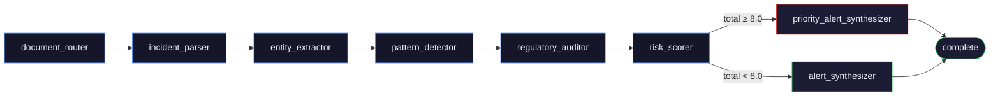

# API reference

Base URL: `http://localhost:8000` in development, the Render service URL in
production. All responses are JSON except the event stream. No authentication —
the public surface is protected by a per-IP rate limit and upload validation.

Interactive docs are at `/docs` outside production.

---

## Endpoints

| Method | Path | Purpose |
|---|---|---|
| `GET` | `/health` | liveness and configuration readout |
| `POST` | `/analyze` | upload a PDF, start an analysis |
| `GET` | `/analyze/{id}/stream` | server-sent events for one analysis |
| `GET` | `/analyze/{id}` | the finished report |
| `GET` | `/history` | completed analyses, paged and filterable |
| `GET` | `/history/stats` | dashboard aggregates |
| `GET` | `/history/{id}` | the finished report (same payload as `/analyze/{id}`) |
| `GET` | `/tools` | the agent's tool set and each tool's argument schema |

---

## `GET /health`

```json
{
  "status": "ok",
  "version": "1.0.0",
  "environment": "production",
  "llm_configured": true,
  "vector_store_backend": "local",
  "vector_store_ready": true,
  "timestamp": "2026-09-20T10:30:00+00:00"
}
```

`vector_store_backend` is `"local"` (an exact in-process numpy search, the
default) or `"qdrant"`. `vector_store_ready` means
the selected backend can actually answer: a built local index, or a reachable
cluster. Both `*_configured` flags being false is a working server with no
corpus and no model — it will still accept uploads and return low-confidence
results.

This is the UptimeRobot keep-alive target. Poll every 14 minutes to stop a free
Render instance cold-starting mid-demo.

---

## `POST /analyze`

Upload a PDF. Returns immediately; the analysis runs in the background.

**Request** — `multipart/form-data` with a single `file` part.

**Response** — `202 Accepted`

```json
{ "analysis_id": "0f4c…", "status": "processing" }
```

If an identical file (SHA-256) was analysed within the cache TTL:

```json
{ "analysis_id": "0f4c…", "status": "cached" }
```

A cached response points at a report that already exists, so the client should
go straight to `GET /analyze/{id}` rather than opening the stream.

**Errors**

| Status | When |
|---|---|
| `400` | not a `.pdf`; empty or under 100 bytes; does not begin with `%PDF` |
| `413` | larger than `MAX_UPLOAD_BYTES` (10MB by default) |
| `429` | more than `MAX_ANALYSES_PER_IP_PER_HOUR` uploads from this address; carries `Retry-After` |

All errors are `{"detail": "…"}`.

**Validation notes for clients.** The declared MIME type and the file extension
are both checked, but neither is trusted: the first bytes must be `%PDF`. The
filename is stripped of directory components and anything not plainly printable
before it is stored or echoed back, so the `file_name` in a report may differ
from what was uploaded.

---

## `GET /analyze/{analysis_id}/stream`

`text/event-stream`. One event per pipeline transition, then the report.

Every event is a `StreamUpdate`:

```json
data: {
  "stage": "pattern_detector",
  "status": "completed",
  "message": "Found 4 precursor patterns across 8 similar historical incidents",
  "data": { "pattern_count": 4, "similar_count": 8 },
  "timestamp": "2026-09-20T10:30:00+00:00"
}
```

| Field | Notes |
|---|---|
| `stage` | an agent node id, or `heartbeat`, `complete`, `error` |
| `status` | `started`, `completed`, `error`, `alive` |
| `message` | human-readable, safe to render directly |
| `data` | stage-specific; the full `AnalysisReport` on the `complete` event |

**Ordering.** Each pipeline node emits `started` then `completed`, in graph
order:



Exactly one synthesizer runs: `priority_alert_synthesizer` when the risk total
is 8.0 or above, `alert_synthesizer` otherwise.

**Terminal events.** The stream ends after `stage: "complete"` or
`stage: "error"`. Nothing follows either.

```json
data: { "stage": "complete", "status": "completed", "message": "Analysis complete",
        "data": { "...": "the full AnalysisReport" } }
```

**Heartbeats.** `{"stage": "heartbeat", "status": "alive"}` every 25 seconds of
silence, to keep proxies from closing the connection. Ignore them.

**Replay.** The channel is created during the upload request, so a client that
connects late — or reconnects — receives every update from the beginning before
it starts tailing live ones. There is no need to race the POST response.

**Timeouts.** A connection is closed with an `error` event after
`STREAM_TIMEOUT_SECONDS` (300). Channels stay replayable for 5 minutes after an
analysis finishes; after that, `GET /analyze/{id}` is the way to read the result.

**Unknown id.** A single `error` event, then the stream closes.

---

## `GET /analyze/{analysis_id}`

The finished `AnalysisReport`. `404` while the analysis is still running, if it
failed, or if the id is unknown.

```json
{
  "analysis_id": "0f4c…",
  "file_name": "press-fatality.pdf",
  "incident": {
    "incident_date": "March 14, 2023",
    "location": "Rockford, Illinois",
    "industry": "manufacturing",
    "equipment_involved": ["hydraulic press", "conveyor"],
    "sequence_of_events": "…",
    "immediate_causes": ["…"],
    "root_causes": ["…"],
    "injury_count": 0,
    "fatality_count": 1,
    "severity_indicator": "CRITICAL",
    "raw_text_length": 1841,
    "extraction_confidence": 1.0
  },
  "entities": [
    { "text": "hydraulic press", "entity_type": "EQUIPMENT", "confidence": 0.9, "source": "spacy" }
  ],
  "similar_incidents": [
    {
      "doc_id": "…", "title": "Stamping press fatality 2021", "industry": "manufacturing",
      "severity": "CRITICAL", "similarity_score": 0.82,
      "chunk_excerpt": "…", "source_document": "osha-2021-0412.pdf",
      "incident_date": "2021-04-12", "hazard_tags": ["lockout_tagout"]
    }
  ],
  "regulatory_clauses": [
    {
      "clause_id": "…", "regulation_name": "OSHA 29 CFR 1910.147", "section": "(c)(4)(i)",
      "clause_text": "verbatim retrieved passage",
      "violation_confidence": 0.87,
      "relevance_explanation": "…"
    }
  ],
  "precursor_patterns": [
    {
      "pattern_name": "Verification step omitted",
      "description": "Zero-energy state never tested before work began.",
      "confidence": 0.85, "evidence_count": 3, "hazard_types": ["lockout_tagout"]
    }
  ],
  "causal_chain": [
    { "order": 0, "label": "Energy isolation was not performed", "node_type": "cause", "relation": "CAUSED_BY" }
  ],
  "risk_score": {
    "total": 8.24,
    "tier": "CRITICAL",
    "components": [
      { "name": "Severity", "score": 9.5, "weight": 0.3, "explanation": "…" },
      { "name": "Frequency", "score": 10.0, "weight": 0.25, "explanation": "…" },
      { "name": "Regulatory", "score": 6.0, "weight": 0.25, "explanation": "…" },
      { "name": "Precursor Density", "score": 4.0, "weight": 0.2, "explanation": "…" }
    ],
    "explanation": "…"
  },
  "alerts": [
    {
      "id": "…", "severity": "CRITICAL", "title": "…", "description": "…",
      "regulatory_violations": ["OSHA 29 CFR 1910.147 (c)(4)(i)"],
      "precursor_patterns": ["Verification step omitted"],
      "created_at": "2026-09-20T10:30:00+00:00"
    }
  ],
  "corrective_actions": [
    {
      "urgency": "IMMEDIATE",
      "action": "…",
      "rationale": "…",
      "regulation_reference": "OSHA 29 CFR 1910.147(c)(4)"
    }
  ],
  "warnings": [],
  "processing_time_seconds": 18.4,
  "created_at": "2026-09-20T10:30:00+00:00"
}
```

**Client-side invariants worth relying on.**

- `risk_score.total` equals the sum of `score × weight` over `components`, to
  two decimals. Rendering the arithmetic is safe.
- `components` is always those four names, in that order.
- `risk_score.tier` follows the total: `≥ 8.0` CRITICAL, `≥ 6.0` HIGH,
  `≥ 4.0` MEDIUM, otherwise LOW.
- `corrective_actions` is sorted IMMEDIATE → SHORT_TERM → LONG_TERM.
- `precursor_patterns` is sorted by `evidence_count`, descending.
- `clause_text` is always retrieved text, never generated.
- `warnings` is non-empty when the result should be read with caution — a very
  short document, a non-incident document, or a thin extraction. Surface it.

Any list may be empty: no corpus means no `similar_incidents` and no
`regulatory_clauses`, and the report is still valid and still scored.

---

## `GET /history`

| Query | Default | Notes |
|---|---|---|
| `page` | `1` | 1-indexed |
| `limit` | `20` | max 100 |
| `severity` | — | `CRITICAL` / `HIGH` / `MEDIUM` / `LOW` / `UNKNOWN`; anything else is `422` |
| `industry` | — | exact match on the parsed industry |

```json
{
  "items": [
    {
      "analysis_id": "0f4c…", "file_name": "press-fatality.pdf", "status": "complete",
      "severity": "CRITICAL", "risk_total": 8.24, "industry": "manufacturing",
      "created_at": "2026-09-20T10:30:00+00:00"
    }
  ],
  "total": 42, "page": 1, "limit": 20
}
```

Rows are summaries, newest first; only completed analyses appear. Fetch
`/history/{id}` for the full report.

---

## `GET /history/stats`

```json
{ "total_analyses": 42, "critical_alerts": 7, "avg_risk_score": 5.81, "industries_covered": 6 }
```

Computed in the database over completed analyses. Zeroed, never absent.

---

## `GET /tools`

The ten tools the agent runs. Names, descriptions and argument schemas are
derived from the functions themselves, so this cannot drift from the code.

```json
[
  {
    "name": "compute_risk_score",
    "description": "Weighted four-component risk score in 0-10. No LLM involved.",
    "parameters": ["corpus_size", "detected_precursors", "known_precursors",
                   "severity", "similar_count", "violated_clauses"],
    "is_async": false
  }
]
```

Sorted by name. Useful for a capabilities panel, and for checking at a glance
that the scoring tool takes no model and no text.

---

## Enumerations

```
SeverityTier   CRITICAL | HIGH | MEDIUM | LOW | UNKNOWN
EntityType     HAZARD | EQUIPMENT | CHEMICAL | CONDITION | UNSAFE_ACT
Urgency        IMMEDIATE | SHORT_TERM | LONG_TERM
StreamStatus   started | completed | error | alive
```

Agent node ids, in pipeline order:

```
document_router, incident_parser, entity_extractor, pattern_detector,
regulatory_auditor, risk_scorer, alert_synthesizer | priority_alert_synthesizer
```

---

## Client notes

**CORS.** Only origins listed in `CORS_ORIGINS` are allowed; credentials are not
permitted, so `fetch` must not set `credentials: "include"`.

**`EventSource` cannot send headers.** None are required — the stream endpoint
takes everything it needs from the URL.

**Rate limiting applies to `POST /analyze` only.** Reads and streams are never
limited, so polling `/health` or re-reading a report is free.

**There is no delete or update.** The API is append-only.
