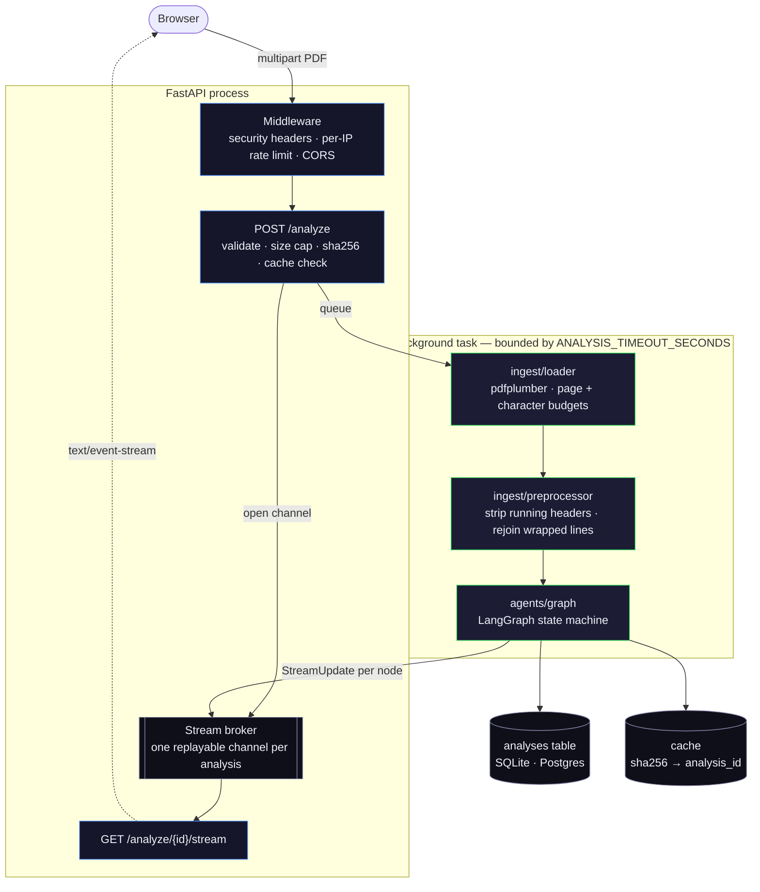
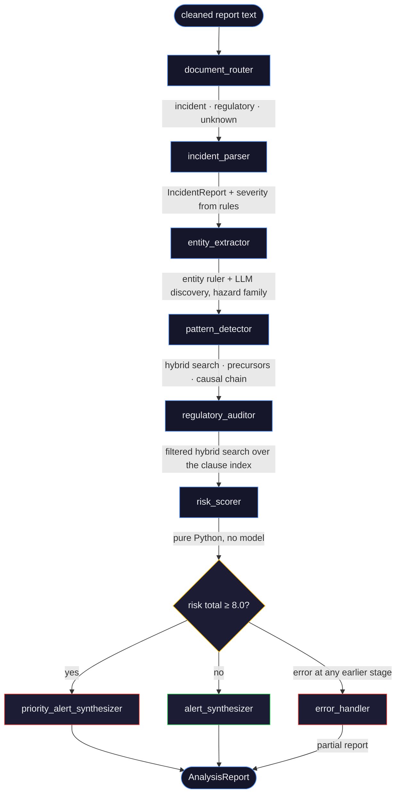
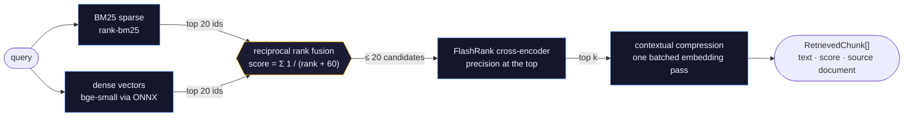
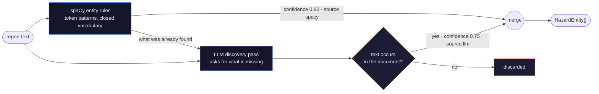

# Architecture

How one upload becomes one report. Read `README.md` first for what SENTINEL is
and how to run it.

---

## The shape of the system



Every stage publishes a `StreamUpdate` to the broker; the SSE endpoint is a
subscriber. Because the channel is opened during the upload request, a client
that connects late is replayed the updates it missed rather than missing them.

## The state machine

`app/agents/graph.py`. Linear through extraction and scoring, one conditional
edge at the end.



**State.** `SentinelState` (`app/agents/state.py`) is a `TypedDict` of plain
JSON-serialisable values. Nodes validate slices of it back into Pydantic models
when they need typed access, and the `AnalysisReport` assembled at the end is
the authoritative shape.

**Error handling.** `app/agents/nodes/base.py` wraps every node with the same
start/complete/error streaming, exception capture and step counter, so the
policy lives in one place instead of eight copies. A node whose incoming state
already carries an error is a no-op — the failure is reported once, by the node
that caused it — and the conditional edge after `risk_scorer` routes to
`error_handler`, which emits a partial report rather than nothing.

**Runaway protection** is LangGraph's own `recursion_limit` (15, against a
longest path of 7), set in `GRAPH_CONFIG`. An earlier hand-rolled counter capped
at 5 and silently truncated every successful run — the end-to-end test now pins
the limit above the real path length.

**The two synthesis paths differ in substance, not wording.** The standard path
composes a deterministic description from the score and the retrieved evidence.
The priority path spends one LLM call writing a specific alert and reports every
detected precursor rather than only the corroborated ones.

## Retrieval

`app/rag/`. Four stages, each addressing a different failure mode of the one
before it.

| Stage | Module | What it fixes |
|---|---|---|
| Semantic chunking | `chunker.py` | fixed-size windows split mid-argument; here a chunk ends where adjacent-sentence similarity drops, inside a section heading |
| Parallel BM25 + dense | `bm25_index.py`, `vector_store.py` | dense retrieval misses exact citations (`1910.147`); sparse retrieval misses paraphrase |
| Reciprocal rank fusion | `retriever.py` | the two rankers disagree; RRF merges on rank, not on incomparable scores |
| Cross-encoder rerank | `retriever.py` (FlashRank) | fusion optimises recall; the reranker restores precision at the top |
| Contextual compression | `compressor.py` | a relevant chunk still carries irrelevant sentences into the citation card |



BM25 and the dense search are the two concurrent branches; everything after the
fusion is sequential. Compression embeds every sentence of the whole result set
in one call rather than one call per chunk — for `k=8` that is one embedding
pass instead of eight.

BM25 and dense search run concurrently through `asyncio.to_thread`; both are
synchronous, CPU-bound library calls.

Embeddings come from `fastembed` (ONNX Runtime) rather than
`sentence-transformers`: the same bge-small-en-v1.5 vectors, without a PyTorch
dependency. It also applies bge's asymmetric query prefix itself and returns
L2-normalised vectors, so a dot product is the cosine similarity throughout.

### Why the default vector store is a numpy array

`vector_store.py` dispatches to one of two real backends.

`local_store.py` is the default: an exact cosine search over a float32 matrix
loaded from an `.npz` file. For the target corpus — 80 documents, roughly 2,000
chunks, 384 dimensions, about 3MB — this is one matrix multiply. It is faster
than a network round trip, exact rather than approximate, needs no credential,
cannot cold-start, and works offline. The on-disk format is plain `.npz` plus a
JSON sidecar, so loading an index cannot execute code.

`qdrant_store.py` takes over when `QDRANT_URL` is set. Approximate nearest
neighbour indexing starts to pay somewhere past ~100k vectors, where the
exhaustive scan reaches ~150MB and tens of milliseconds. Below that it is a
dependency, a credential and a network hop bought for nothing.

This is not an interface with one implementation — both paths are real, and the
switch is one environment variable.

## Entity extraction

`app/tools/parsing.py`. Two sources, each labelled in the output so the UI can
show which is which.

The **entity ruler** is a token-pattern dictionary (`data/entity_patterns.json`)
running on a blank spaCy pipeline. It is precise and cheap, and it matches
multi-token patterns like `did not verify` that a regex would mangle. Entities
from it carry confidence 0.9 and `source: "spacy"`.

There is deliberately **no statistical NER by default**. Measured against real
incident text, `en_core_web_sm` contributed only a date and a cardinal on top of
the ruler — nothing that maps to any of the five entity types. Setting
`SPACY_MODEL` to a real pipeline layers it back on; its entities arrive at
confidence 0.6 and are sent for LLM adjudication.



The **LLM pass** asks for entities the dictionary does *not* already contain,
rather than re-confirming ones it does. The ruler is a closed vocabulary, so
recall is the real gap; a second opinion on a verbatim dictionary hit buys
nothing. Proposed entities are rejected unless their text actually occurs in the
document, which bounds the model's ability to invent one. They carry confidence
0.75 and `source: "llm"`.

## Scoring

`app/tools/scoring.py`. Deterministic, weighted, and reconcilable by hand:

```
R = 0.30 × severity + 0.25 × frequency + 0.25 × regulatory + 0.20 × precursor_density
```

Component scores are rounded to two decimals *before* they are weighted, so the
four numbers the UI shows add up to the total the UI shows. An explainable score
that does not reconcile is not explainable.

- **severity** — `SEVERITY_TO_SCORE[tier]`; the tier comes from casualty counts
  and keyword rules, with the LLM consulted only when no rule is decisive.
- **frequency** — matched share of the indexed corpus. Retrieval returns
  chunks, so matches are deduplicated by source document before the ratio is
  taken; both sides are then document counts.
- **regulatory** — summed `CLAUSE_WEIGHT_MAP` weights of the clause families
  implicated by retrieved clauses scoring above `VIOLATION_CONFIDENCE_FLOOR`.
  That score is derived from a clause's **rank**, not from FlashRank's raw
  output: the reranker orders well but is not calibrated, scoring a verbatim
  matching clause at 0.00003, which zeroed this component until it was caught
  by running against a real index.
- **precursor_density** — precursors detected ÷ precursors known for the hazard
  family, from `data/precursors.json`.

## Precursor detection

Every precursor present in the report is returned, carrying the number of
retrieved historical incidents that show it too. There is deliberately **no
corroboration threshold**: only about eight compressed excerpts are retrieved,
so any meaningful cutoff silently discards real findings — an earlier
`MIN_EVIDENCE_COUNT = 3` meant nothing ever qualified.

`evidence_count` is the honest signal and travels with the pattern to the UI, so
a claim about history carries the count that supports it, and `0` renders as
"not corroborated in the corpus". Confidence rises with corroboration and is
capped at 0.95 — a keyword match is strong evidence, never proof.

## Citation integrity

Nothing asks a model to produce a regulation. `retrieve_regulatory_clauses`
returns retrieved passages; `clause_text` is verbatim from the regulatory index,
`violation_confidence` is the cross-encoder score. A standard that is not in
`data/regulatory/` cannot appear in output.

Corrective actions are the one place where authored content appears: the
templates in `data/actions.json` carry a `regulation_reference` that *points at*
a standard without quoting it. For hazard families with no template, the LLM is
asked for actions and instructed to reference only the clauses actually
retrieved.

## Persistence and caching

One table, `analyses`, with the report stored as JSON and the columns needed for
filtering (severity, industry, risk total) denormalised onto the row. Alerts
live inside the report because nothing queries them independently.

`DATABASE_URL` defaults to SQLite so a fresh clone runs; point it at Supabase
with `postgresql+asyncpg://` in production. Tables are created at startup —
there are no migrations, because the schema is one additive table.

The cache is Upstash over REST, with an in-process dict fallback so local
development and the test suite need no external service. It holds two things:
`analysis:{sha256}` → analysis id for an hour, and `ratelimit:{ip}` counters.

## Security controls

| Control | Where |
|---|---|
| Upload read in chunks, refused as soon as it passes the limit | `api/analyze.py::read_capped` |
| Magic-number check — the MIME type and extension are not trusted | `api/analyze.py::validate` |
| Filename stripped of directories and non-printables, length-capped | `api/analyze.py::safe_filename` |
| Temp file named from the generated id, never the upload | `api/analyze.py` |
| PDF page and character budgets | `ingest/loader.py` |
| Whole-analysis timeout | `pipeline.py` |
| SSE connection deadline | `stream.py` |
| Per-IP hourly cap, with `Retry-After` | `main.py::rate_limit` |
| `X-Forwarded-For` trusted only when `TRUST_PROXY_HEADERS=true` | `main.py::client_ip` |
| Rate-limit key URL-escaped before it reaches a REST path | `main.py` |
| Security headers on every response, CSP `default-src 'none'` | `main.py::SECURITY_HEADERS` |
| CORS restricted to configured origins, credentials off | `main.py` |
| Exception detail logged, never streamed: callers get stage + exception type | `agents/nodes/base.py`, `pipeline.py` |
| Interactive docs disabled in production | `main.py` |

`tests/test_security.py` covers each of these, so removing one breaks a test.

## Testing strategy

149 tests, no network access, a few seconds to run.

| File | Scope |
|---|---|
| `test_tools.py` | the risk formula and its caps, severity rules, precursor corroboration, citation→family mapping, action templates |
| `test_rag.py` | reciprocal rank fusion, BM25 index and its disk round trip, sentence and section splitting, header stripping |
| `test_agents.py` | conditional routing, node error semantics, recursion limit headroom, partial reports, SSE replay |
| `test_api.py` | upload validation, rate limiting, cache hits, history paging, failure without a 500 |
| `test_security.py` | one test per control in the table above |
| `test_end_to_end.py` | a generated PDF through the real HTTP API and the real pipeline |

The end-to-end test stubs exactly two boundaries — the sentence embedder and the
LLM providers (`tests/fixtures.py`). Everything between them is production code:
pdfplumber, preprocessing, classification, hybrid retrieval, fusion,
compression, scoring, synthesis, SQLAlchemy and the SSE broker. The embedder
double is a deterministic bag-of-words hasher, which keeps retrieval meaningful
without a 67MB model download in CI.

Warnings are errors (`pyproject.toml`), with two narrow exemptions for
third-party resources cleaned up at garbage-collection time.

## Extension points

- **A new hazard family** — add it to `data/precursors.json` and
  `data/actions.json`, and add its citation pattern to `_CLAUSE_FAMILIES` and
  `CLAUSE_WEIGHT_MAP`. No code changes.
- **A new entity type** — add patterns to `data/entity_patterns.json` and a
  member to `EntityType`.
- **A new pipeline stage** — write the node with the `@node` decorator, add it
  to `_PIPELINE` in `graph.py`, and add its id to the frontend's `AGENT_STAGES`.
- **A larger corpus** — set `QDRANT_URL` and re-run the ingest scripts.
